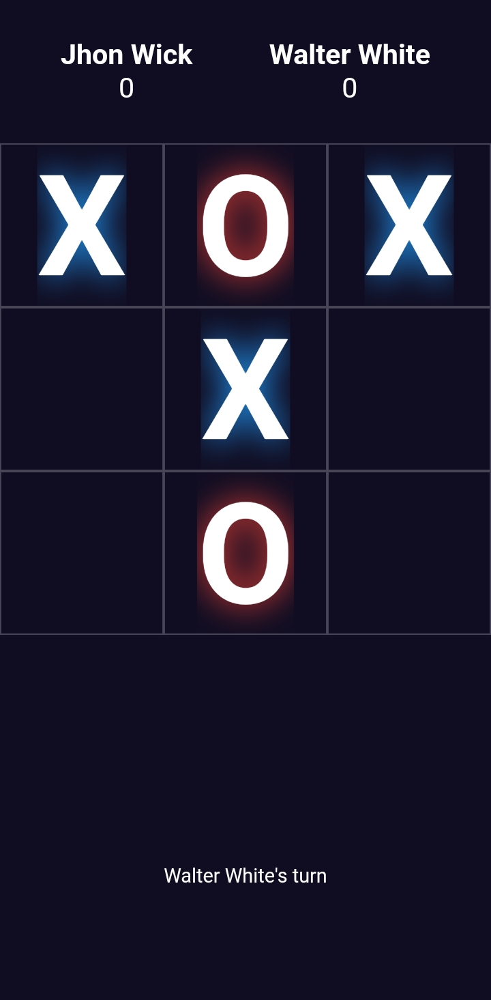
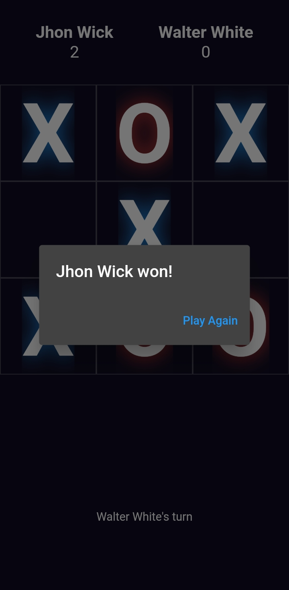

# Multi Player TicTacToe Game

A real-time multiplayer Tic-Tac-Toe game built with Flutter, MongoDB, and Socket.IO.

## Features

- Real-time gameplay with multiple players
- Player authentication and management using MongoDB
- User-friendly interface with clear game state
- Win/lose/draw conditions and game over handling


## Running the app

Clone the repository

```
git clone https://github.com/withmohitjoshi/mp_tictactoe.git
```

Navigate to the directory

```
cd ./mp_tictactoe
```

Install required packages

```
flutter pub get
```

To run the <b>Server</b> you need to create a <b>.env</b> in server folder and place <b>MONGODB_URI</b> as your mongo db url

```
cd ./server
npm run dev
```

Run the app

```
flutter run
```

## Snapshots




